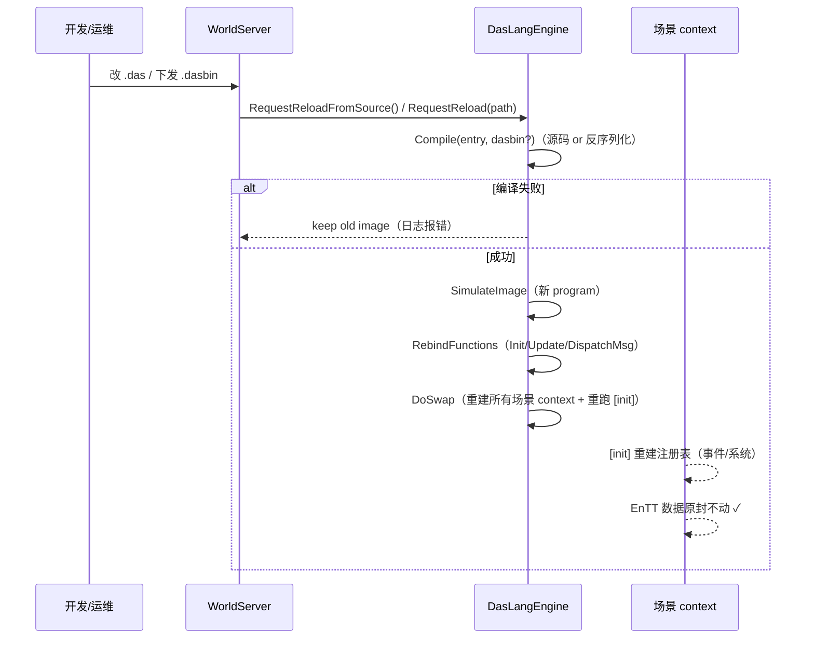

# 热重载与 AOT（ECS_07）

> 契约见 `ECS_00` §2（铁律 1）/ §7（安全约束）。本篇给出**可照抄实现**：
> 多 context（每场景）改造 → 双通道热重载（源码 + dasbin）→ dasbin IV 修复 → AOT 收尾。
> 交付后：开发期改脚本即热更；生产期下发 dasbin 热更；AOT 全量原生 + 热更回退解释器。

---

## 1. 现状与目标

### 1.1 现状（已核实）

- `DasLangEngine` 单 context：`_scriptImage.ctx`（`DasImage.h`），`SimulateImage` 创建
- `OnContextSwapped` 回调已存在（`IDasModuleProvider`），World 当前空实现
- `DasLangSerializer::Save` 用 `blobLen` 派生 IV（**安全缺陷**，见 §4）
- AOT 已接线：`AotGen` + `Rules.das_aot`（release 全量）
- `fail_on_no_aot=false`：热更改动函数回退解释器

### 1.2 目标（ECS_00 拍板）

1. **每场景 1 context**（铁律 3）——`DasLangEngine` 持 context 池
2. **双通道热重载**：开发期源码（FileWatcher 已有）+ 生产期 dasbin（RequestReload 已有）
3. **dasbin IV 修复**（安全）
4. **AOT + 热更共存**（hybrid）

---

## 2. 多 context 改造（每场景 1 context）

```cpp
// DasImage.h —— 扩展：每场景一个 context 的 image
struct DasLangImage
{
    std::unique_ptr<das::ModuleGroup> moduleGroup;
    das::FileAccessPtr                fileAccess;
    das::ProgramPtr                   program;

    // 每场景 context（key = sceneId）
    // MVP 单场景：仍用 ctx；多场景：改用 map
    std::shared_ptr<das::Context>     ctx;

    // 缓存入口函数（全局唯一——函数代码共享）
    das::SimFunction *funcInit        = nullptr;
    das::SimFunction *funcUpdate      = nullptr;
    das::SimFunction *funcDispatchMsg = nullptr;

    std::string errors;
    bool IsValid() const { return ctx != nullptr; }
};
```

### 2.1 每场景 context 创建

```cpp
// DasEngine.h 新增
das::Context *GetSceneContext(uint16 sceneId);
void RegisterSceneContext(uint16 sceneId);
void UnregisterSceneContext(uint16 sceneId);

// DasEngine.cpp
das::Context *DasLangEngine::GetSceneContext(uint16 sceneId)
{
    auto it = _sceneContexts.find(sceneId);
    return it == _sceneContexts.end() ? nullptr : it->second.get();
}

void DasLangEngine::RegisterSceneContext(uint16 sceneId)
{
    if (!_scriptImage.program)
    {
        return;
    }
    // 从共享 program clone 一个 context（函数代码共享，数据独立）
    auto ctx = std::make_shared<das::Context>(_scriptImage.program->getContextStackSize());
    das::TextWriter logs;
    if (!_scriptImage.program->simulate(*ctx, logs))
    {
        Log::Error("DasEngine: scene {} context simulate failed:{}", sceneId, logs.str());
        return;
    }
    _sceneContexts[sceneId] = ctx;
    _moduleProvider->OnContextSwapped(ctx);
}

void DasLangEngine::UnregisterSceneContext(uint16 sceneId)
{
    _sceneContexts.erase(sceneId);
}

// 私有成员
std::unordered_map<uint16, std::shared_ptr<das::Context>> _sceneContexts;
```

> **关键**：`das::Context` 可以从**同一个 Program** 多次 `simulate` 创建（context 文档：
> 函数代码/常量串堆/AOT 链接在 context 间共享）。`RegisterSceneContext` 就是每场景
> clone 一个 context。**Program 编译一次，context 克隆 N 次**。

### 2.2 热重载时重建所有 context

```cpp
// DoSwap 扩展：热重载后所有场景 context 重建
void DasLangEngine::DoSwap(DasLangImage &&img)
{
    _moduleProvider->DrainTimers();

    // 记住旧场景 context 列表
    std::vector<uint16> sceneIds;
    for (auto &[sid, ctx] : _sceneContexts)
    {
        sceneIds.push_back(sid);
    }

    _scriptImage = std::move(img);
    _lastGCHeapSize = 0;

    // 重建每场景 context
    _sceneContexts.clear();
    for (uint16 sid : sceneIds)
    {
        RegisterSceneContext(sid);
    }

    if (_scriptFileWatcher)
    {
        _scriptFileWatcher->SetFiles(CollectDependencyFiles());
    }
}
```

> **铁律 1 的体现**：context 重建丢的是**脚本侧状态**（注册表/值拷贝），
> **EnTT 组件数据原封不动**——玩家位置/血量/AI 状态全部保留。

---

## 3. 双通道热重载

### 3.1 开发期源码热重载（已有，扩展多 context）

```cpp
// DasFileWatcher（已有）→ RequestReloadFromSource（已有）→ PollReload（已有）
// 改动：PollReload 内 Compile 后 DoSwap 会重建所有场景 context（§2.2 已处理）
// 无需额外改动——DoSwap 已覆盖多 context
```

### 3.2 生产期 dasbin 热更（已有，扩展多 context）

```cpp
// RequestReload(path)（已有）→ PollReload → Compile(entryFile, dasbinPath)
// dasbin 命中缓存 → program 反序列化 → DoSwap 重建 context
// 同样被 §2.2 覆盖
```

### 3.3 热更时序（一次完整热更）



---

## 4. dasbin IV 修复（安全必修）

### 4.1 问题（`DasSerializer.cpp` 现状）

```cpp
// 现状：IV 从 blobLen 派生——同密钥下，两个长度相同的脚本 IV 完全重用
uint8 iv[Aes256Gcm::kIvSize] = {0};
std::memcpy(iv, &blobLen, sizeof(blobLen) < Aes256Gcm::kIvSize ? sizeof(blobLen) : Aes256Gcm::kIvSize);
```

**风险**：GCM 同 IV + 同密钥 → 密钥流重用 → 密文可被异或破解（严重）。

### 4.2 修复方案：随机 IV + 头内携带

```cpp
// DasSerializer.cpp Save 部分
if (encrypted)
{
    // 随机 12 字节 IV（Aes256Gcm::kIvSize）
    uint8 iv[Aes256Gcm::kIvSize];
    Crypto::RandomBytes(iv, Aes256Gcm::kIvSize); // 需要项目有 CSPRNG（见下）

    auto enc = Crypto::Aes256Gcm::Encrypt(key, iv, blob, blobLen);
    if (!enc)
    {
        Log::Error("DasLangSerializer Save encrypt failed");
        return false;
    }
    payloadOwned.reserve(Aes256Gcm::kIvSize + enc->Size());
    payloadOwned.insert(payloadOwned.end(), iv, iv + Aes256Gcm::kIvSize);
    payloadOwned.insert(payloadOwned.end(), enc->Data(), enc->Data() + enc->Size());
    payload    = payloadOwned.data();
    payloadLen = payloadOwned.size();
}
```

```cpp
// Load 侧对应：从 payload 头部取回 IV
if (encrypted)
{
    if (payloadLen < Aes256Gcm::kIvSize)
    {
        Log::Error("DasLangSerializer: encrypted payload too short");
        return false;
    }
    const uint8 *iv = payload;
    const uint8 *ct = payload + Aes256Gcm::kIvSize;
    const size_t ctLen = payloadLen - Aes256Gcm::kIvSize;
    auto dec = Crypto::Aes256Gcm::Decrypt(key, iv, ct, ctLen);
    ...
}
```

> **CSPRNG 来源**：项目 `Common/Crypto/` 有 `EcdhX25519`/`Aes256Gcm`——检查是否有
> `RandomBytes`；没有则加（openssl `RAND_bytes`，项目已依赖 openssl）。

### 4.3 依赖文件 mtime 记录（dasbin 缓存失效）

`DasLangSerializer::Save` 已写 deps（path + mtime）——**保持**。Load 时校验：
任一依赖文件 mtime 变了 → dasbin 失效 → 全量重编译。当前 `DasEngine::Compile` 已有
"dasbin miss fallback to full compile"逻辑（`DasEngine.cpp:226`）——**已实现，保留**。

---

## 5. AOT 收尾（AOT + 热更共存）

### 5.1 现状

- `AotGen` 已实现 B2 方案（复用 daslib `aot()`，注册 Common + world 模块）——**保留**
- `Rules.das_aot` 已接线（release，`World/main.das` → `.das.cpp` 编进 exe）——**保留**
- `MakePolicies`：release `aot=true` + `fail_on_no_aot=false`——**正确**（热更回退）

### 5.2 必须确认的 AOT 约束

1. **脚本必须能 AOT**：`main.das` 及其 require 闭包**不能**含 `options no_aot`。
   `MsgHandlerRegistry.das` 用了 `[function_macro]`（宏）——宏函数本身在 AOT 生成端跑，
   业务 handler（`handle_move_test`）是普通函数，**可 AOT**。
2. **`[game_event]`/`[game_system]` 宏展开后**：注册代码在 `[init]` 里跑（运行时），
   handler 函数体可 AOT。宏展开是编译期——不影响 AOT 匹配（aotHash 对展开后 AST 计算）。
3. **DECS 出局**：`decs_boost.das` 自带 `options no_aot`——我们的脚本**不 require** decs
   （ECS_00 已确认），所以 AOT 闭包不含 decs，无冲突。

### 5.3 AOT 验证（本篇验收关键）

```powershell
# 1. Release 构建（触发 AOT 生成）
xmake f -m release
xmake build WorldServer

# 2. 检查 AOT 生效
#    日志或调试：fn->aot == true（DasEngine 加诊断日志）
#    或：生成的 .das.cpp 存在于 autogendir

# 3. 热更回退验证
#    改一个 handler 函数 → 重新生成 dasbin → 下发
#    预期：改动函数 fn->aot == false（回退解释器），其他函数仍 aot == true
```

---

## 6. 构建脚本变动

- `Src/ScriptEngine/xmake.lua`：无（DasEngine 内部改）
- `Src/World/DasModule/xmake.lua`：无
- **新增诊断**：`RebindFunctions` 加 `Log::Info("... AOT={}", fn->aot)` 便于验证

---

## 7. 验证步骤（本篇验收）

```powershell
# A. 开发期热重载
# 1. Debug 构建 + 启动
# 2. 改 Script/World/main.das（加一行 LogInfo）
# 3. 保存 → 日志出现 "Script hot-reloaded"
# 4. 玩家实体数据（位置/血量）不丢（铁律 1）

# B. 生产期 dasbin 热更
# 1. Release 构建（生成 .dasbin）
# 2. 运行期触发 RequestReload(path)
# 3. 日志 "Script hot-reloaded"，AOT 命中部分继续原生

# C. IV 修复验证
# 1. 连续 Save 两次（同密钥）
# 2. 两次 IV 不同（读文件头验证）
```

**验收标准**：
- [ ] 多场景 context 创建/重建正确（每场景独立，代码共享）
- [ ] 热重载后 EnTT 数据不丢（位置/血量保留）
- [ ] dasbin IV 每次 Save 随机（同密钥不重用）
- [ ] Release AOT 生效（`fn->aot == true`）
- [ ] 热更后改动函数回退解释器（`fn->aot == false`），未改动函数仍 AOT

---

## 8. 踩坑预警

1. **`das::Context` 多实例**：同一 Program 多次 `simulate` 创建 context 是官方支持的
   （contexts 文档：代码/常量堆共享）。但**共享全局变量**（`module shared`）跨 context
   共享——`g_EventRegistry` 等若声明在 shared 模块会跨 context 共享（多场景共享注册表），
   **这可能是想要的**（事件注册表全局唯一）或不想要的（场景隔离）。按需选 module 修饰符。
2. **`OnContextSwapped` 时序**：每次 context 创建都回调——`WorldDasModule::OnContextSwapped`
   当前空实现，若以后要缓存 per-context 数据，在这里做（context 切换时清理）。
3. **`PollReload` 多线程**：`RequestReload` 可从任意线程调（IO 线程），`PollReload` 在
   LogicThread tick——`_reloadMutex` 已有，保持。
4. **IV 修复影响**：旧 dasbin（旧 IV 方案）无法加载——发布新版本后需重新生成 dasbin，
   或 Load 侧兼容旧格式（检测头版本字段 `formatVersion`——**已存在**，`kDasbinFormatVersion`
   递增即可区分）。
5. **AOT 与 `[game_event]` 宏**：宏在编译期展开，AOT 生成的是展开后的函数——只要
   `DispatchGameEvents`/handler 函数体不含 daslib 宏的 `no_aot` 约束，即可 AOT。
   若遇 aotHash 漂移，检查 `MakeScriptPolicies` 的 `forAotGen` 与运行期是否逐字段一致
   （ECS_00 §7 约束）。
